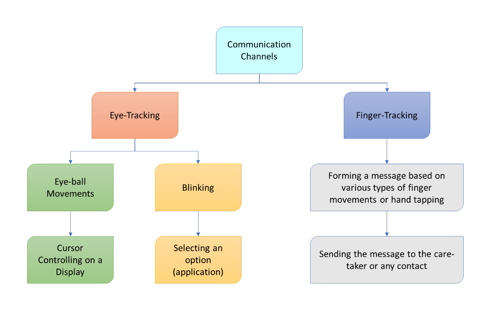

# **The Smart Assistive Communication System - CommuniCare**

## **Introduction**

The Smart Assistive Communication System - CommuniCare is a tool designed to improve the communication abilities of paralysis patients. Utilizing advanced AI and affordable technology, this system translates subtle finger or eye movements into coherent sentences. By providing a real-time, intuitive, and user-friendly interface, it significantly reduces isolation and frustration, enhancing the quality of life for individuals with conditions like quadriplegia, paraplegia, stroke, ALS, or severe cerebral palsy. This innovative solution ensures effective communication and better interaction with caregivers and loved ones and ensures that the voices of those who face difficulty in speaking are heard loud and clear.

## **Overview**

The CommuniCare employs a camera to detect finger or eye movements, translating them into coherent sentences via advanced AI algorithms. It features a user-friendly interface, customization options and timely reminders for medications and checkups. Designed with affordability in mind, it utilizes the cost-effective Raspberry Pi Zero 2 W, making it accessible to a wider range of patients. This system not only empowers paralysis patients by enhancing communication but also supports caregivers and healthcare providers in delivering more efficient and personalized care.

## **Operational Workflow Diagram**

## **Model Training Videos**

We implemented a sophisticated Blink Detection feature that enables our system to accurately detect when a user blinks and distinguish between voluntary and involuntary blinks. This advanced capability allows blinks to be utilized for a range of practical purposes.

Voluntary blinks can be used to select items on a screen or to simulate mouse clicks, thereby providing an intuitive method for users to interact with their devices. This feature enhances the overall functionality of the system, making it possible for users to perform various tasks without needing to rely on traditional input methods.

We have developed an eye-controlled cursor system using Python's OpenCV library. This system tracks the movement of the iris and moves the mouse cursor accordingly, allowing users to control their computer with eye movements.

This kind of control method provides users with an efficient way to navigate their computer, enhancing accessibility and ease of use for individuals with limited mobility.

We have developed a specialized keyboard for typing, designed to cater to the needs of users with severe mobility limitations. The keyboard features three rows, each containing ten keys. Users can select a row by blinking their eyes, utilizing the blink detection system previously described. Once a row is selected, the user can type by using specific finger movements, detected by our previously trained AI models.

This approach combines eye blinks and finger movements to provide an efficient and user-friendly typing experience. By leveraging the capabilities of our advanced AI models, we ensure that users can communicate effectively and with minimal effort, despite their physical limitations.

## **Tasks Completed Until Now**
### **Model Training**

- To ensure our system can accurately detect and classify various hand movements, we undertook a comprehensive data collection process. We gathered a diverse dataset of hand orientations and finger movements, specifically focusing on minimal movements that individuals with severe paralysis can perform.

### **Data Collection**

- The data collection process involved capturing numerous images and videos of different hand and finger positions. We included a variety of movements, such as:

   - Hand Lifting: Various degrees of hand elevation.
   - Finger Movements: Individual finger lifts, particularly focusing on minimal movements like lifting just the index finger.

### **Detection Capabilities**

- As a result of this rigorous training process, our AI model can accurately detect whether the hand is lifted or if just a specific finger, such as the index finger, is raised. The model is sensitive enough to detect minimal movements, ensuring that even the slightest gestures are recognized. This precision is particularly important for providing reliable control mechanisms for paralyzed patients.
## **Features Implemented Until Now**
